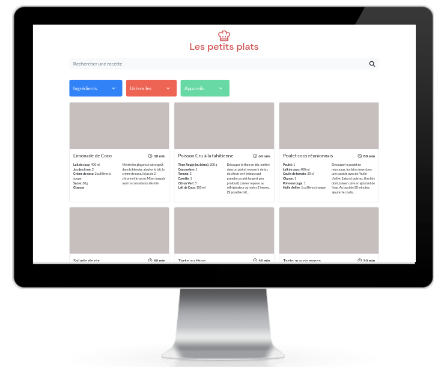
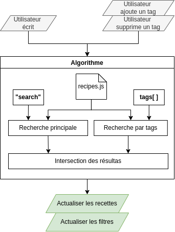
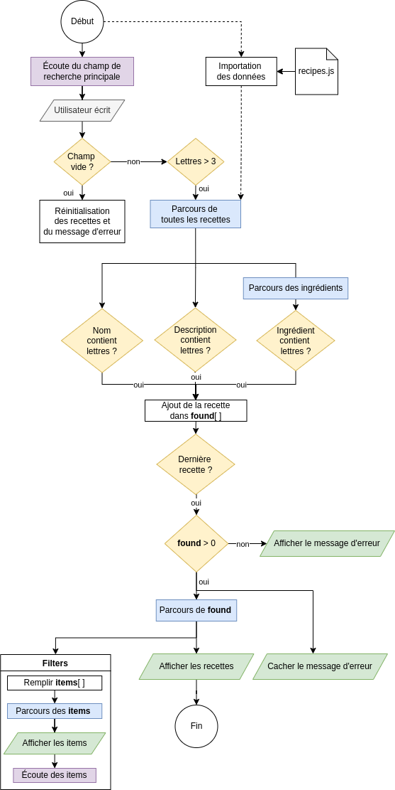

# oc-p7-petitsplats
This project is the n°7 in the [OpenClassrooms Front-End learning path](https://openclassrooms.com/fr/paths/516-developpeur-dapplication-javascript-react).

I work for the company "Les Petits Plats" which wants to create a site of cooking recipes. I have to create the interface in Bootstrap according to the mockup. And I have to develop a powerful search algorithm in JavaScript.

## ✨ Demo
- https://jeromeabel.github.io/oc-p7-petitsplats/

## Algorithm Design

## Algorithm Main Search

## 🚀 Usage
Just open the index.html in your browser and type some letters or words in the search bar. You can also choose in the filters to find recipes.

## 👤 Author
- [@jeromeabel](https://github.com/jeromeabel)

## 📝 License
- [GNU--GPL--3](https://www.gnu.org/licenses/gpl-3.0.fr.html)